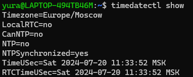
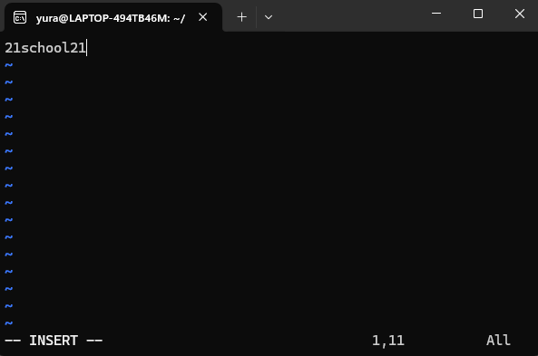
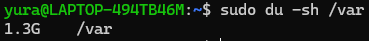

# D01_Linux
Here you can see completed project tasks

## Part 1. Installation of the OS
* Команда для просмотра версии:  `cat /etc/issue`

* **etc** - в этой директории находятся файлы с найстройками системы и многих программ 

## Part 2. Creating a user
* `useradd` - это утилита командной строки, которую можно использовать для создания новых пользователей в системах Linux и Unix. Общий синтаксис команды следующий: `useradd [OPTIONS] USERNAME`

> Только root или пользователи с привилегиями sudo могут создавать новые учетные записи пользователей с помощью useradd.

* Для добавления в группы пользователя используется флаг `-G`

* Использованная команда: `sudo useradd -G adm tempUser`  

* Вывод команды `cat /etc/passwd`:  

## Part 3. Setting up the OS network
* ___Задание названия машины вида user-1___  
`hostname` - позволяет проверить текущее название имя хоста комрьютера  
`hostnamectl` - отображает дополнительную информацию о вашей компьютерной системе  
`hostnamectl set-hostname new-hostname` - изменяет имя хоста машины  

* ___Установка временной зоны, соответствующей моему текущему местоположению.___  
Утилита `timedatectl` применяется для настройки и получения информации о текущем системном времени. Она доступна в системах, использующих systemd.  
  
Для установки часового пояса с помощью утилиты `timedatectl` нужно выполнить команду: `timedatectl set-timezone Europe/Moscow`  
С помощью команды `timedatectl list-timezones` можно увидеть список всех доступных временных зон.

* ___Вывод названия сетевых интерфейсов с помощью консольной команды.___  
Существует множество способов вывода названий сетевых интерфейсов, например: `ifconfig`(depricated), `netstat -i`, `ip address` и др.  
  
> lo (loopback device) – виртуальный интерфейс, присутствующий по умолчанию в любом Linux. Он используется для отладки сетевых программ и запуска серверных приложений на локальной машине. С этим интерфейсом всегда связан адрес 127.0.0.1. У него есть dns-имя – localhost. Посмотреть привязку можно в файле /etc/hosts.

* ___Используя консольную команду, получи ip адрес устройства, на котором ты работаешь, от DHCP сервера.___  
Примером DHCP-сервера является LAN-роутер.  
Для получение ip адреса устройства можно использовать команды: `ip address`, `hostname -I` и др.  

> DHCP — протокол прикладного уровня модели TCP/IP, служит для назначения IP-адреса клиенту. Это следует из его названия — Dynamic Host Configuration Protocol.  

* ___Определи и выведи на экран внешний ip-адрес шлюза (ip) и внутренний IP-адрес шлюза, он же ip-адрес по умолчанию (gw).___  

* ___Задай статичные (заданные вручную, а не полученные от DHCP сервера) настройки ip, gw, dns (используй публичный DNS серверы, например 1.1.1.1 или 8.8.8.8).___  
Конфигурационный файл для изменения данных:  

> Для работы с изменением данных понадобилось установить NetworkManager.
> Для изменения применялась команда: `sudo netplan apply`, после требуется обновить, можно использовать команду: `sudo systemctl restart NetworkManager`  

* ___Перезагрузи виртуальную машину. Убедись, что статичные сетевые настройки (ip, gw, dns) соответствуют заданным в предыдущем пункте.___  
Теперь мы видим новый ip-адрес:  
  
Пингуем ya.ru и 1.1.1.1:  

## Part 4. OS Update
* Сущесвует две важные команды, связанные с обновлением пакетов:
`sudo apt update` - обновляет информацию об актуальных версиях доступных пакетов 
`sudo apt upgrade` - обновляет пакеты  

## Part 5. Using the sudo command
> sudo (англ. Substitute User and do, дословно «подменить пользователя и выполнить») — программа для системного администрирования UNIX-систем, позволяющая делегировать те или иные привилегированные ресурсы пользователям с ведением протокола работы. Основная идея — дать пользователям как можно меньше прав, при этом достаточных для решения поставленных задач. Программа поставляется для большинства UNIX и UNIX-подобных операционных систем.  
* Чтобы пользователю дать права sudo, его нужно добавить в группу sudo: `usermod -a -G sudo [user]`
* Чтобы сменить пользоваетеля, можно использовать команду `sudo -i -u [user]`, где -i(login) и -u(user)  

## Part 6. Installing and configuring the time service
* Для переключение на более надежный проткол NTPD (Network Time Protocol daemon) выполняются следующий шаги:
    1. Отключается стандартная утилита, команда: `sudo timedatectl set-ntp no`
    2. Обновить пакеты системы, команда: `sudo apt update`
    3. Установить ntp: `sudo apt install ntp`  
    Вывод команды `timedatectl show`:  
    

## Part 7. Installing and using text editors

* Используя каждый из трех выбранных редакторов, создай файл test_X.txt, где X -- название редактора, в котором создан файл. Напиши в нём свой никнейм, закрой файл с сохранением изменений.  
    1. Vim: (для выхода и сохранения: esc -> shift+: -> wq)  
      
    2. Nano: (для выхода: ctrl+o сохранение, ctrl+x выход)  
      
    3. Joe: (для сохранения и выхода: ctrl+k+x)  
      

* Используя каждый из трех выбранных редакторов, открой файл на редактирование, отредактируй файл, заменив никнейм на строку «21 School 21», закрой файл без сохранения изменений.  
    1. Vim: (сначала в режим редактирования с помощью i, для выхода и сохранения: esc -> shift+: -> q!, чтобы не сохранять изменения)  
    
    2. Nano: (ctrl+x, далее выбрать no)  
    
    3. Joe: (ctrl+c, далее выбрать yes)  
    

* Используя каждый из трех выбранных редакторов, отредактируй файл ещё раз (по аналогии с предыдущим пунктом), а затем освой функции поиска по содержимому файла (слово) и замены слова на любое другое.  
    1. Vim: заходим в режим поиска через esc, пришем через / слово, редактируем поимвольно через r  
    
    
    2. Nano: замена с помощью команды ctrl+\  
    
    3. Joe: ctrl+f, ищем слово, следуем указаниям редактора  
    

## Part 8. Installing and basic setup of the SSHD service
* Устанавливаем ssh
* Командой `systemctl status sshd` проверяем работоспособность:  

* Командой `systemctl list-unit-files --type=service --state=enabled` можно проверить, какие команды автоматически загружаются при загрузке системы. Также можно проверять отдельные службы с помощью: `sudo systemctl is-enabled [service]`
* С помощью `sudo systemctl status [service]` можно проверить, находится ли сервер в автозагрузке и запущен ли он сейчас

* Смена порта:
    1. Открытие конфигурационного файла: `sudo vim /etc/ssh/sshd_config`
    2. Редактирование порта  
    
    3. Перезапуск SSH-сервера: `sudo systemctl restart sshd`  
    
* Используя команду ps, покажи наличие процесса sshd. Для этого к команде нужно подобрать ключи.  
Используем команду: `ps -A -f | grep "ssh"`  
-f - вывести максимум доступных данных, например, количество потоков 
-A - выбрать все процессы  
* Вывод `netstat -tan`:  
  
__-t__ - выдает TCP-порты   
__-a__ - отображать все сокеты  
__-n__ - разрешать имена  
__proto__ - протокол, используемый сокетом  
__Recv-Q__ - счётчик байт не скопированных программой пользователя из этого сокета  
__Send-Q__ - счётчик байтов, не подтверждённых удалённым узлом  
__Local Address__ - адрес и номер порта локального конца сокета. Если не указана опция --numeric (-n), адрес сокета преобразуется в каноническое имя узла (FQDN), и номер порта преобразуется в соответствующее имя службы  
__Foreign Address__ - адрес и номер порта удалённого конца сокета. Аналогично "Local Address."  
__State__ - состояние сокета  
0.0.0.0 является немаршрутизируемым мета-адресом, используемым для обозначения недопустимой, неизвестной или не применимой цели (нет конкретного адресатора). В контексте серверов 0.0.0.0 означает «все адреса IPv4 на локальном компьютере»

## Part 9. Installing and using the top, htop utilities
Команда top показывает запущенные в Linux процессы программ и служб, данные о потреблении системных ресурсов и позволяет искать, останавливать процессы и управлять ими.  
* В первой строке последовательно: uptime, количество авторизованных пользователей, общая загрузка системы
* Во второй строке: общее колчиество процессов
* Третья строка: загрузка CPU
* Четвертая строка: загрузка памяти
* pid процесса, занимающего больше всего памяти: 505 (с помощью x - сортировка)
* pid процесса, занимающего больше всего процессорного времени: 505 (с помощью x - сортировка)  

Команда htop выполняет примерно ту же задачу, что и top, но имеет определённые преимущества и недостатки: более удобные поиск и фильтрация, но менее гибкая настройка отображения процессов.  
* Сортировка по определенному параметру производится с помощью sortBy:  
  
* Фильтрация с помощью filter:  
  
* Поиск с помощью search:  
  
* Добавление в вывод дополнительной информации:  
  

## Part 10. Using the fdisk utility

* __fdisk__ - это команда для управления разделами жёсткого диска, а также получения информации о них.  
  
Измерения производятся в МиБ (мебибайт)  
* Для нахождения размера swap: `free -h`  
  

## Part 11. Using the df utility
* __df__ - это команда для получения подробного отчета об использовании дискового пространства системы.  
*   
    1. Размер раздела: 1055762868
    2. Размер занятого пространства: 2177992
    3. Размер свободного пространства: 999881404 
    4. Процент использования: 1%  
    Размер выводится в байтах  

*   
    1. Размер раздела: 1007G 
    2. Размер занятого пространства: 2.1G 
    3. Размер свободного пространства: 954G  
    4. Процент использования: 1%  
    Тип файловой системы: ext4  
    __Ext4__ - ext4 (англ. fourth extended file system, ext4fs) — журналируемая файловая система, используемая преимущественно в операционных системах с ядром Linux, созданная на базе ext3 в 2006 году.  

## Part 12. Using the du utility
* __du__ - это команда для получения приблизительного объема дискового пространства, используемого указанными при вызове команды файлами или каталогами.  
* Чтобы выводить информацию в человеко читаемом виде: `du -sh`  
    __-s__ - ключ вывода только общего размера  
    __-h__ - вывод в более читабельном виде  
* /home  
  
* /var  
  
* /var/log  
  
* /var/log/*  
  

## Part 13. Installing and using the ncdu utility
* __ncdu__ - это команда, имеющая то же назначение, что и du, но обладающая приятным и удобным интерфейсом.  
* /home  
  
* /var  
  
* /var/log  
  

## Part 14. Working with system logs
* Время последней успешной авторизации: Jul 20 21:36:04 for user root(uid=0) by yura(uid=1000)
* Перезапуск службы SSHd: `sudo sysyemctl restart ssh`

## Part 15. Using the CRON job scheduler
* CRON - это программа-демон. Её основная задача выполнять указанные пользователем процессы в указанное пользователем время, например с определённой периодичностью.  
* Запуск uptime через каждые две минуты:
    1. Открытие: `crontab -e`, добавление строки: */2 * * * * uptime
    2. Поиск в логах: `cat /var/log/syslog`  
    
    3. Список текущих задач: `crontab -l`  
    
    4. Удаление всех заданий из планировщика: `crontab -r`  
    
